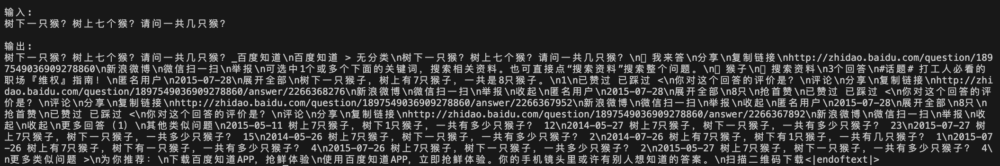

# Clear-R1
Unlike other repositories that focus more on curve analysis, we emphasize interesting phenomena and process analysis to make it easier for everyone to understand what is happening.

## Disclaimer!
This repository's code is inspired by [DeepSeek-RL-Qwen-0.5B-GRPO-gsm8k](https://github.com/waylandzhang/DeepSeek-RL-Qwen-0.5B-GRPO-gsm8k/blob/main/train-checkpoint-900.ipynb) and [deepseek_r1_train](https://github.com/wyf3/llm_related/blob/main/deepseek_learn/deepseek_r1_train/deepseek_r1_train.py) and is not original. I have only conducted experimental analysis based on it. Thanks for their endeavor!

## Bitter Lessons
**Don't use models that are not INSTRUCTION! But, Why?**

Qwen-2.5-3B output

Qwen-2.5-3B-GRPO output

* 
* 